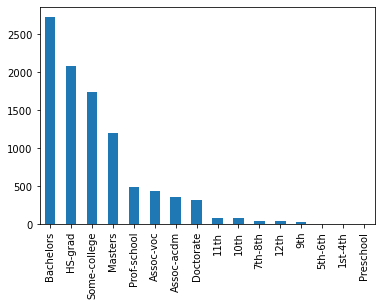

# Semester 2 Capstone Project - Income Predictor

## Authors
 * Alberto Torres

## Overview
 * Business Problem
      * For this project I wanted to build a model that colleges can show potential college students how likely they are to make over 50K
      a year if they decided to pursue a college education.  
       
 * Business Solution
      * College can recommend going to college will allow students to make more than 50K a year than those people that do not 
      go to college.
      * Having a bachelors can put you over 50K a year faster rather than those who have a High School education.

## Business Understanding
  * College enrollment are slowly declining throughout the United States. College's can use this model to show potential students
  how more likely they are to make more than 50K a year if they pursue a college education. They can show that the median income in the United States currently of High School graduates that do not go to college falls around 40K. 
    
 
## Data Understanding and Analysis
   * Source of data
     * [Income Dataset](https://www.kaggle.com/datasets/mastmustu/income)
    
   * Description of data & Features used
     * Income Dataset
       * education
       * occupation
       * race
       * gender
       * relationship
       * Hours worked per week
    

     
     
   *(Figure 1)* Demonstration of people who make over 50K sorted by education
   
   
   
   *(Figure 2)* Visualizing the popular movie directors baed on their average rating and highest number of votes.
   
   
 
   *(Figure 3)* Visualizing the distribution of movie ratings and where the mean and median lie.
   
   
   
   *(Figure 4)* Visualizing that there is a statistical significance that higher rated movies make more money.
   
   

   *(Figure 5)* Most profitable movie genres.

   

       
## Statistical Communication
   * Q: Do movies with a rating of at least 6.5 lead to a higher revenue?
   * A: There is a statistical significance that higher rated movies make more money.
   * Q: Which genres perform the best, given a high rating and high total profit?
   * A: Musical, Animation, Sci-Fi, and Adventure

## Results
   * Advantages
     * Avoid common pitfalls through intelligent investment
     * Greatly improve return on investment potential
     * Reduce losses
   * Limitations
     * Lack pricing for directors
     * Return on investment is easily skewed
     * Limited data for some countries

## Conclusion

   * Invest in top genres
   * Release in areas with top languages.
   * Research pricing for directors.
   * Continue researching trends.

## Next Steps

   * Gather more data on customer interest. (i.e. surveys)
   * Research the top languages per region.
   * Continually analyze trends using current datasets.

## For More Information

See the full analysis in the [Jupyter Notebook](./Notebook.ipynb) or review this [presentation](./presentation.pdf).

Link to our repository: https://github.com/jaeminlee95/Semester1_Capstone_Group_3
